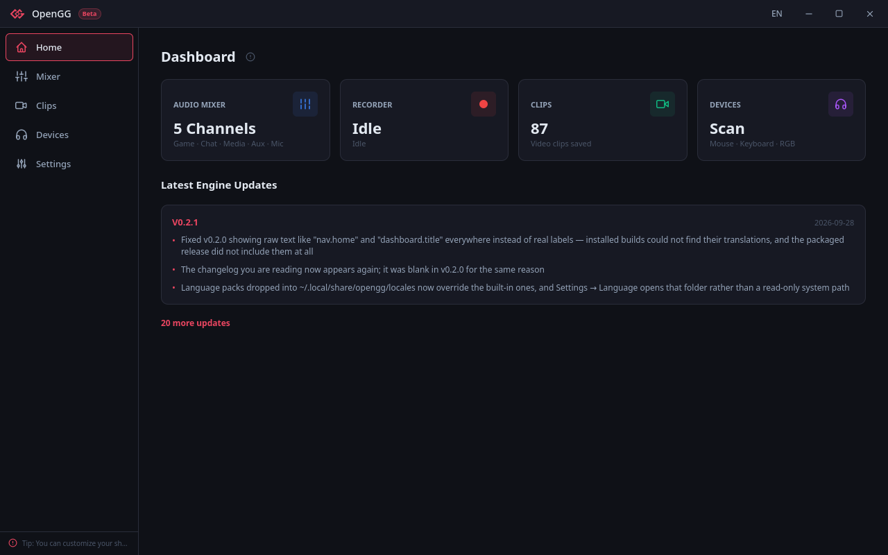
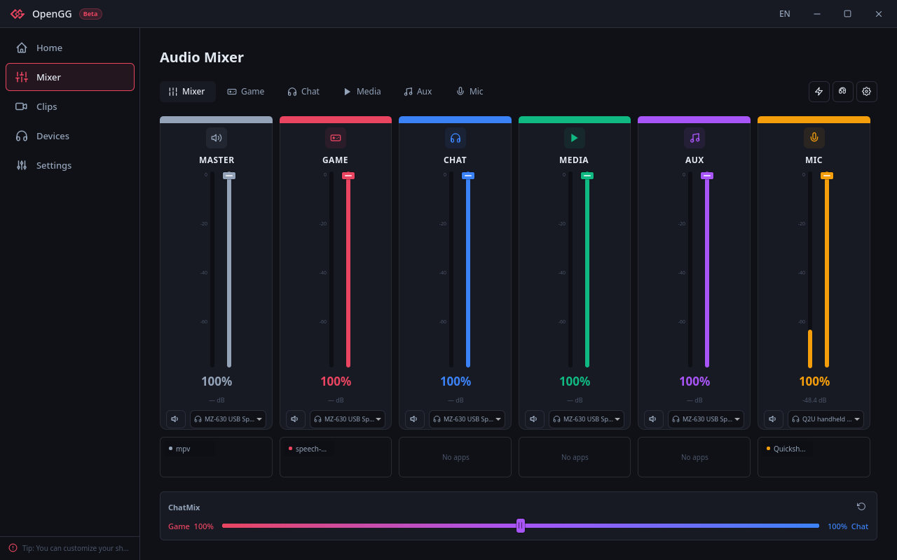
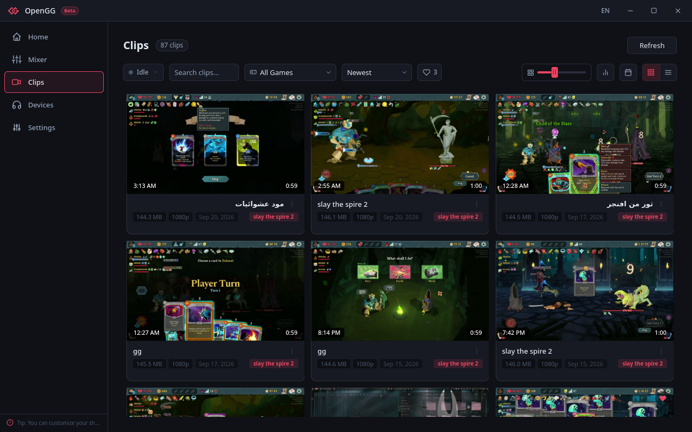
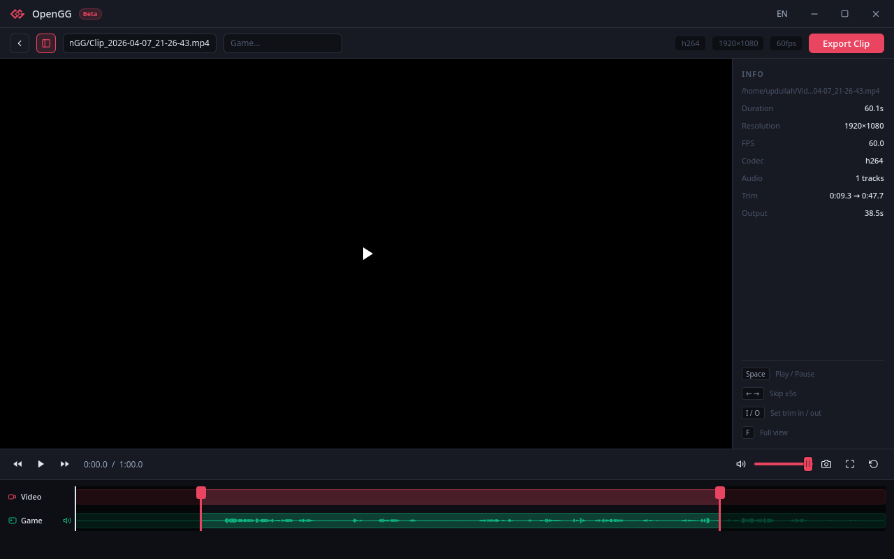
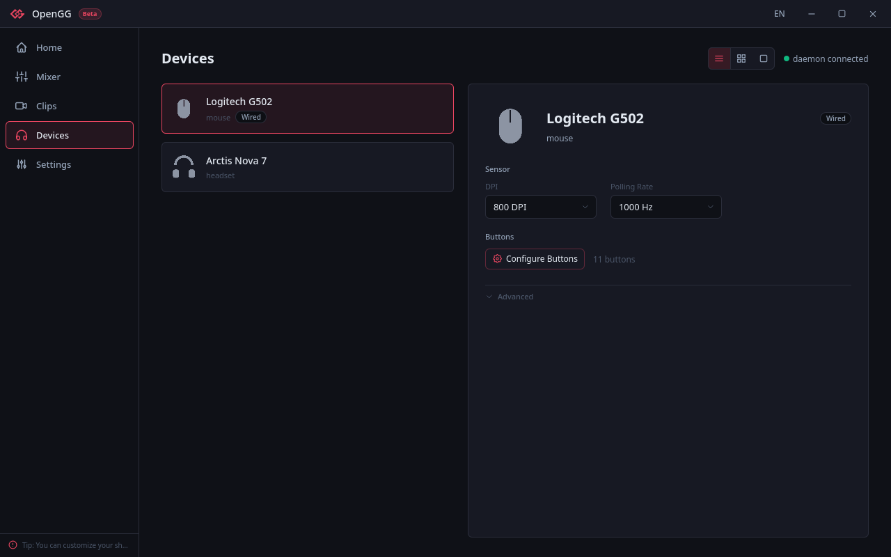
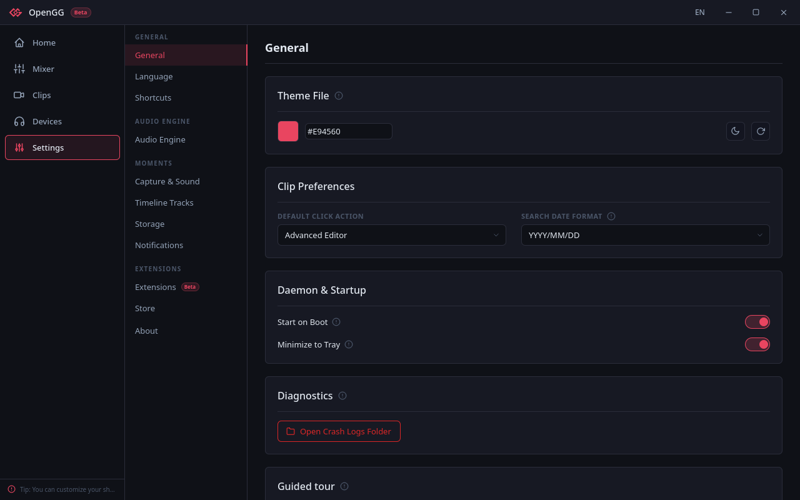

<p align="center">
  
</p>

<h1 align="center">OpenGG</h1>

<p align="center">
  <b>v0.2.1</b> · An open-source Linux gaming hub — audio mixer, device &amp; RGB manager, instant replay.<br/>
  A modular alternative to SteelSeries GG (Sonar + Engine + Moments).
</p>

---

## Screenshots

| Dashboard | Audio Mixer |
|---|---|
|  |  |

| Clips | Clip Editor |
|---|---|
|  |  |

| Devices | Settings |
|---|---|
|  |  |

## Install

**Arch / CachyOS** — installs the binary plus udev rules, D-Bus policy and systemd units:

```bash
yay -S opengg-bin
```

**From source:**

```bash
git clone https://github.com/UPdullah895/opengg.git
cd opengg
./dev.sh setup    # data dirs + the `input` group (asks for your password once)
./dev.sh          # daemon + UI, unified logs
```

## Modules

- **Audio Hub** — 5-channel PipeWire mixer (Game / Chat / Media / Aux / Mic), per-app routing, 10-band EQ, ChatMix.
- **Device & RGB** — mouse DPI, polling rate and button mapping via ratbagd; headset controls; RGB via the OpenRGB SDK.
- **Clipping & Replay** — gpu-screen-recorder replay buffer, global hotkeys, clip gallery, multi-track editor with FFmpeg export.

## Requirements

Rust (stable) to build. At runtime:

```bash
sudo pacman -S qt6-base qt6-declarative qt6-multimedia \
               pipewire pipewire-pulse wireplumber \
               gstreamer gst-plugin-qml6 ffmpeg xdg-desktop-portal
yay -S gpu-screen-recorder
```

`gpu-screen-recorder` needs NVENC (NVIDIA) or VAAPI (AMD / Intel).

## Development

| Command | What it does |
|---|---|
| `./dev.sh` | Daemon + UI with unified logs |
| `./dev.sh daemon` / `./dev.sh ui` | One half only |
| `./dev.sh build` | Release build |
| `make install` | Install to `~/.local/bin` + locales to `~/.local/share/opengg` |
| `make lint` | clippy + `check-colors.sh` |

The three crates — `daemon/`, `core/`, `qt-shell/` — are built independently; there is no Cargo workspace. The Qt shell links `opengg-core` and reaches `openggd` over D-Bus.

Working on the UI? Read [`AGENTS.md`](AGENTS.md) first — it carries the QML landmines and the mandatory pre-commit checks. See also [`CONTRIBUTING.md`](CONTRIBUTING.md), [`docs/EXTENSION_DEV.md`](docs/EXTENSION_DEV.md) and [`docs/TRANSLATING.md`](docs/TRANSLATING.md).

## Data locations

| Data | Path |
|---|---|
| Daemon config | `~/.config/opengg/daemon.toml` |
| UI settings / theme | `~/.config/opengg/ui-settings.json`, `theme.json` |
| Clips DB + thumbnails | `~/.local/share/opengg/` |
| Default clips dir | `~/Videos/OpenGG/` |
| Extensions | `~/.local/share/opengg/extensions/` |
| Language packs | `~/.local/share/opengg/locales/` |
| Crash log | `~/.local/share/opengg/opengg_crash.log` |

## Troubleshooting

**Clip playback stalls** — install `gst-plugin-qml6` (runtime only).

**Global hotkeys do nothing** — they read `/dev/input` directly, which needs the `input` group. `./dev.sh setup` adds you; log out and back in.

**No virtual sinks / routing fails** — check you are in the `audio` group and that `systemctl --user status pipewire wireplumber` are running. **Settings → Danger Zone → Remove Virtual Audio** resets routing.

## Security model

No sudo at runtime — the daemon is unprivileged and gets what it needs from the `audio`, `input` and `video` groups. It auto-activates over D-Bus rather than being launched by hand.

## License

MIT
